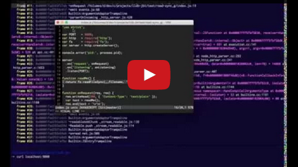
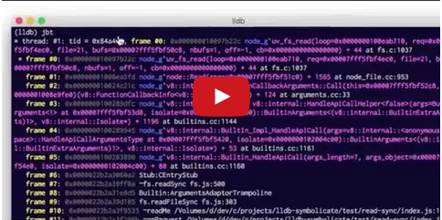

# lldb-jbt


## Screencasts

Debugging Node.js with lldb and jbt                                              |  Debugging Node.js with Xcode and jbt
:-------------------------------------------------------------------------------:|:--------------------------------------------------------------------------------------:
[](http://youtu.be/hy9o5Crjy1A) | [](http://youtu.be/_oMt1vCwod0)

## Installation

```
npm install -g lldb-jbt
```

**Requires Node.js version `0.11.13` or higher** and works best with a *debug* build.

For more information see Node.js [build instructions](https://github.com/thlorenz/lldb-jbt/wiki/Building-Node.js).

## Usage

1. Add the script dir to your `PYTHONPATH` by running `source jbt`
2. Debug your node process with `--perf-basic-prof` flag, i.e. `lldb -- node --perf-basic-prof index.js`
3. Import the **jbt** command into lldb `command script import jbt`
4. Set a breakpoint, i.e. `b uv_fs_read`
5. When you hit the breakpoint type `jbt` to see the stack trace with JavaScript symbols resolved

## Xcode

To make things work with Xcode do the following:

1. Run `jbt` to determine where `jbt.py` was installed on your machine
2. Add a `~/.lldbinit-xcode` file which will be picked up by Xcode with the below content

```
command script import <path/to/jbt.py>
```

Now the **jbt** command will initialize itself and is accessible to you in the **lldb** console inside Xcode.

## License

MIT
